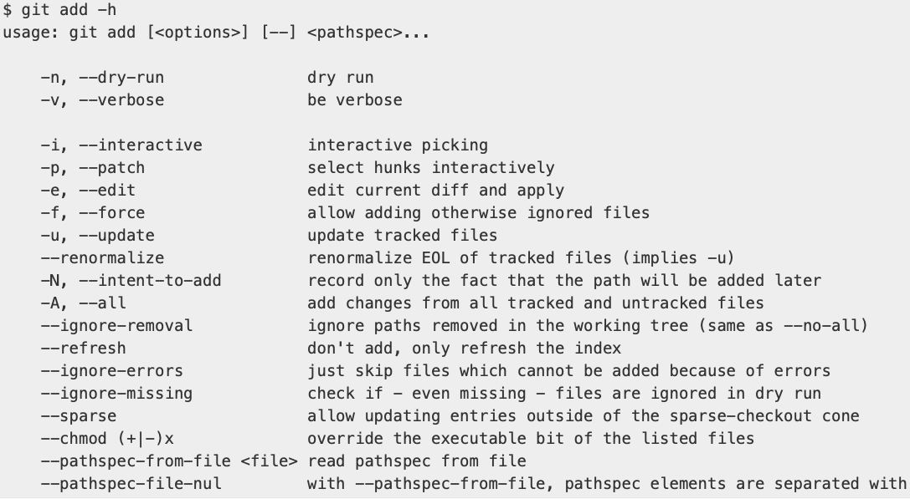

# 1.1 Getting Started - About Version Control

- Version Control: A system that records changes to a file or set of files over time so that you can recall specific versions later. 

- RCS (Revision Control System): VCS where differences between files were kept as *patch sets* in a special format on disk; it can then re-create what any file looked like at any point in time by adding up all the patches. 

- Distributed Version Control Systems: Clients fully mirror the repository, including its full history. 

# 1.2 Getting Started - A Short History of Git

- Created by the Linux development community in response to BitKeeper DVCS relationship fallout in the early 2000's.

- Goals for Git:
    1. Speed
    2. Simple Design
    3. Strong Support for Non-linear Development (thousands of parallel branches)
    4. Fully Distributed
    5. Able to handle large projects. 

# 1.3 Getting Started - What is Git?

- Delta-based Version Control: NOT GIT, Systems like CVS, Subversion, Perforce where only the differences or changes (deltas) are recorded between version of a file. 

- Checksummed: When commits are made in Git (which is a snapshot-based system), the files are checksummed. This means each file’s contents are hashed using SHA-1, a cryptographic hash function. Any change to the file, even a single character, produces a new and completely different hash value.
    - SHA-1: 40-character string composed of hexadecimal characters (0-9 and a-f). 
        - `24b9da6552252987aa493b52f8696cd6d3b00373`
    
- Three Main States:
    1. Modified: You have changed the file but have not committed it to your database yet.
    2. Staged: You have marked a modified file in its current version to go into your next commit snapshot.
    3. Committed: The data is safely stored in your local database.

- Three Main Sections:
    1. Working Tree: A single checkout of one version of the project. The files are pulled out of the compressed database in the Git Directory and placed on disk for you to use. 
    2. Staging Area: A file contained in the Git Directory that stores information about what will go into your next commit. 
    3. Git Directory: Where Git stores the metadata and object database for your project. 

# 1.4 Getting Started - The Command Line

- The command-line will be used as our primary interface for interacting with Git. 

# 1.5 Getting Started - Installing Git

- `git --version` --> `git version 2.39.5 (Apple Git-154)` 

# 1.6 Getting Started - First-Time Git Setup

- `git config`: A command tool that lets you get and set configuration variables that control all aspects of how Git looks and operates. These are stored in 3 places:
    1. `[path]/etc/gitconfig` file
    2. `~/.gitconfig` or `~/.config/git/config` file
    3. `config`file in the Git Directory

# 1.7 Getting Started - Getting Help

- 3 Ways to Get Help
    1. `git help <verb>`
        - `git help config` 
    2. `git <verb> --help`
    3. `man git-<verb>`

- A quick refresher on the available options for a Git command can be called with the `-h` as in: `git add -h` 

# 1.8 Getting Started - Summary

- Learned about the history and set-up of Git!