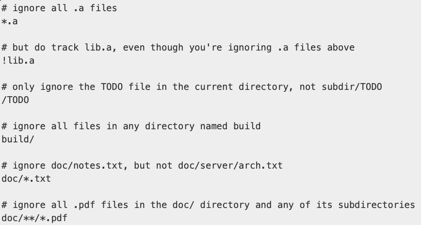
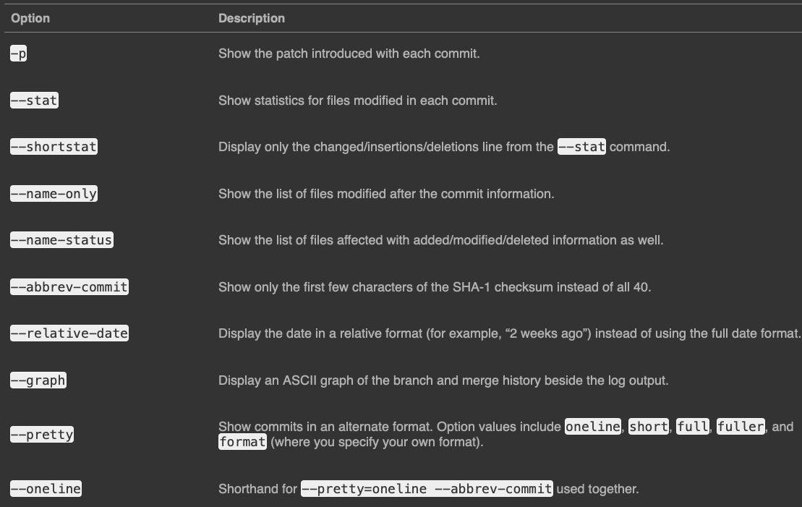
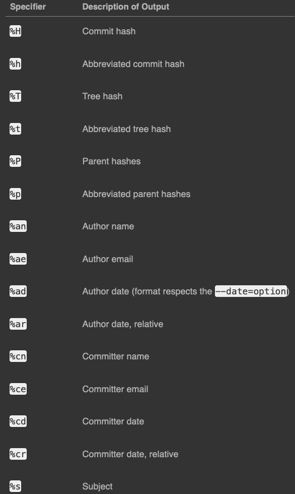
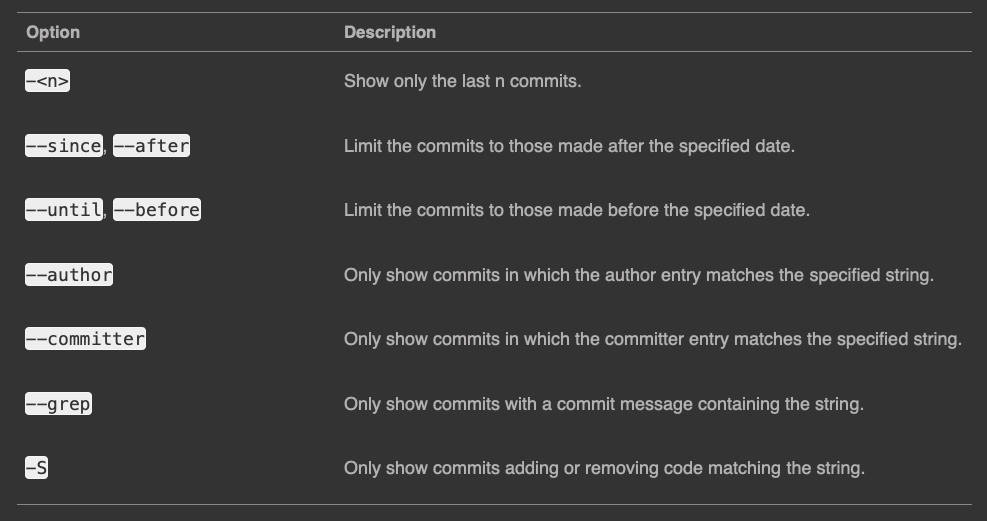
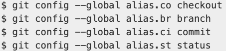
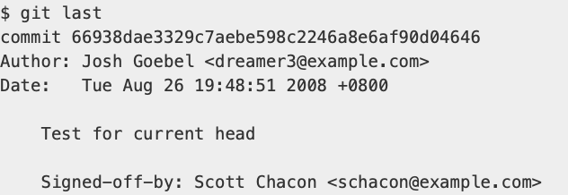

# 2.1 Git Basics - Getting a Git Repository

- Two Ways to Typically Get a Git Repository
    1. Turn a local directory, that is not currently a Git repo. and turn it into a Git repo. 
        - `cd` in the project directory. 
        - type command `git init`
    2. `clone` an exisiting Git repo. from elsewhere.
        - `git clone`
        - `git clone <url>`

# 2.2 Git Basics - Recording Changes to the Repository

- Files in the working directory change be in 2 states:
    1. `tracked`: Files that were in the last snapshot, as well as any newly staged files; they can be unmodified, modified, or staged. 
    2. `untracked`: Files that were not included in the last snapshot and are not in the staging area. 

- Checking Status of Files: 
    - `git status`
    - `git status -s` or `git status --short` (short status)

- NOTE: `main`(in GitHub) vs `master`(in Git) for default branch.

- Tracking a File: `git add`
    - `git add filename`
    - `git add directory`

- Ignoring Files: `.gitignore`
    - Specify *patterns* for files and file types to be ignored by Git.
    - Rules For Patterns:
        1. Blanks lines or lines starting with `#` are ignored.
        2. Standard glob patterns work, and will be applied recursively throughout the entire working tree.
            - Glob Patterns: 
        3. You can start patterns with a forward slash `/` to avoid recursivity.
        4. You can end patterns with a forward slash `/` to specify a directory.
        5. You can negate a pattern by starting it with an exclamation point `!`.

- View Staged Changes 
    - `git diff`: Compares what is in your working directory with what is in your staging area.
    - `git diff --staged` or `git diff --cached`: See what you have staged that will go into your next commit. 
    - `git difftool`: View file differences with external tools not Git standard. 

- Commiting Your Changes
    - `git commit`: Commits staged files to the main branch. 
    - `git commit -v`: Provides an explicit reminder of what you've modified. 
    - `git commit -m *"message"*`: Bypass the text editor for providing a message to the commit, and allow for an in-line message to be provided at the time of call. 
    - `git commit -a`: Makes Git automatically stage every file that is already tracked before doing the commit, skipping the `git add` part. 

- Remove Files
    - `rm filename.ext`: Removes the file for the working directory, making the deletion a change that is not yet staged. 
    - `git rm filename.ext`: Removes the file from the working directory making the deletion a change that is staged, to be committed. 
    - `git rm filename.ext -f`: Force removes the file if said file is modified or added to the staging area. 
    - `git rm --cached filename`: Git will stop tracking the file, but the file will remain on disk within your working directory. Past commits still contain the file.
    - You can pass files, directories, and file-glob patterns to the `git rm` command. 

- Renaming Files
    - `git mv file_from file_to`: Change the name of the file from `file_from` to `file_to`. 

# 2.3 Git Basics - Viewing the Commit History

- Viewing the Commit History
    - `git log`: Lists the commits made in that repository in reverse chronological order; that is, the most recent commits show up first.
    
    - `git -p` or `git --patch`: Shows the difference (the `patch` output) introduced in each commit.
        - Limit entries returned back with `-#`, where `#` is an integer. 
    - `git log --stat`: Prints below each commit entry a list of modified files, how many files were changed, and how many lines in those files were added and removed. It also puts a summary of the information at the end.
    - `git log --pretty`: Changes the log output to formats other than the default.
        - `git log --pretty=oneline`: Prints each commit on a single line.
        - `git log --pretty=short`
        - `git log --pretty=full`
        - `git log --pretty=fuller`
        - `git log --pretty=format`: Allows you to specify your own log output format.
        
        - `git log --graph`: Adds a ASCII graph showing your branch and merge history.
- Author vs Committer:
    - Author: Person who originally wrote the work.
    - Committer: Person who last applied the work.

- Limiting Lot Output

    

# 2.4 Git Basics - Undoing Things

- How to Undo Things:
    - `git commit --amend`: Takes your staging area and uses it for the commit. If you’ve made no changes since your last commit (for instance, you run this command immediately after your previous commit), then your snapshot will look exactly the same, and all you’ll change is your commit message.

# 2.5 Git Basics - Working with Remotes

- Remote Repositories: Versions of a project that are hosted on the internet or network somewhere. 

- `git remote`: Shows which remote servers are configured to said repo.
- `git remote -v`: Shows you the URLs that Git has stored for the shortname to be used when reading and writing to that remote.
- `git remote add <shortname> <url>`:
- `git fetch <remote>`: Get data from your remote projects.
- `git pull`: Automatically fetch and then merge that remote branch into your current branch.
- `git push <remote> <branch>`: 
- `git remote show <remote>`: More information about a particular remote.
- `git remote rename`: Change a remote’s shortname.
- `git remote remove` or `git remote rm`: Remove a remote. 

# 2.6 Git Basics - Tagging

- Tags: Specific points in a repository’s history as being important.

- `git tag`: Lists the tags in alphabetical order
- `git tag -l` or `git tag --list`:

- 2 Types of Tags:
    1. `lightweight`: A pointer to a specific commit. 
        - `git tag <tagname>`: Creates a lightweight tag.
    2. `annotated`: Stored as full objects in the Git database. They’re checksummed; contain the tagger name, email, and date; have a tagging message; and can be signed and verified with GNU Privacy Guard (GPG).
        - `git tag -a <tagname> -m "<message>"`: Creates an annotated tag.
- `git show <tagname>`: Shows the tag information data. 
- `git tag -a <tagname> <checksum>`: Creates a tag on a past commit via is checksum code.

- Pusing Tags:
    - `git push origin <tagname>`: Pushed the tag with `<tagname>` to the remote server. 
    - `git push origin --tags`: Push all tags to the remote server.
    - `git push <remote> --follow-tags`: Only annotated tags will be pushed. 

- Deleting Tags

    - Deleting Local Tags:
        - `git tag -d <tagname>`: Deletes a tag from your local repo. 

    - Deleting Remote Tags:
        - `git push <remote> :refs/tags/<tagname>`
        - `$ git push origin --delete <tagname>`

- Checking Out Tags
    - `git checkout <tagname>`: View the versions of files a tag is pointing to.
        - Puts your repository in “detached HEAD” state.

# 2.7 Git Basics - Git Aliases

- Git Aliases: Shortcuts customized by the user to shorten calls to Git commands. 
    - Aliases can be defined within the `git config` command. 
    
    - Useful for creating commands you think should exist
    
    

# 2.8: Git Basics - Summary

- Learned about creating or cloning a repository, making changes, staging and committing those changes, and viewing the history of all the changes the repository has been through