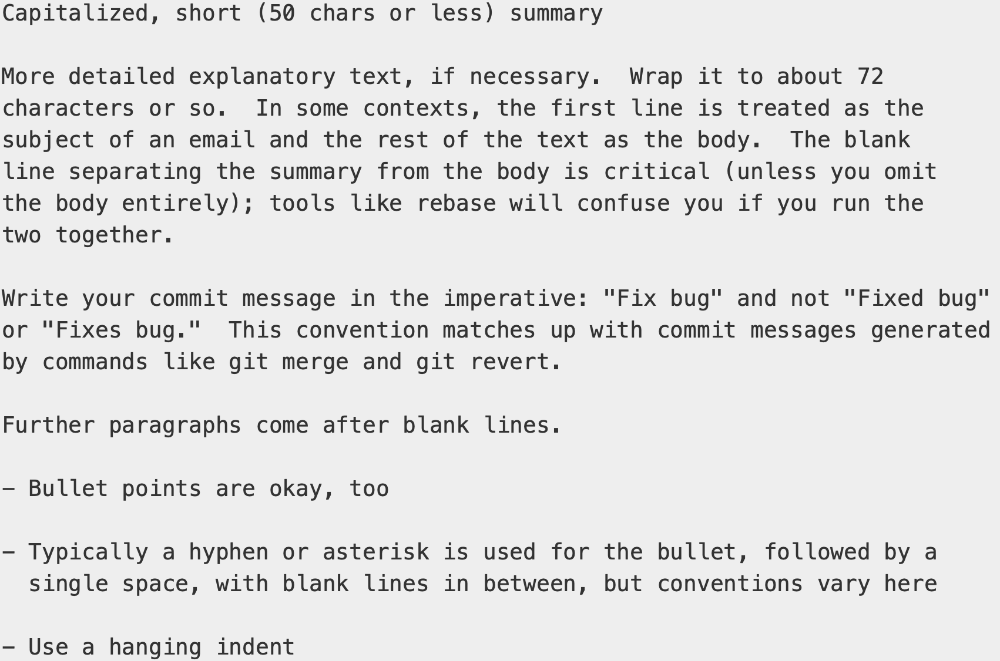

# 5.1 Distributed Git - Distributed Workflows

- Centralized Workflow: All developers push and pull from a single central repository, usually hosted on a remote platform like GitHub, GitLab, or Bitbucket.

- Dictator and Lieutenants Workflows:
    - **Lieutenants**: Trusted contributors who manage specific subsystems or features of the project. They act as integration managers, reviewing and merging changes within their area of responsibility.
    - **Benevolent Dictator**: The central project leader or maintainer who oversees the entire project. They merge the lieutenants’ master branches into the main project’s master branch and update the reference repository, which serves as the project’s official source of truth.

# 5.2 Distributed Git - Contributing to a Project

- Commit Guidelines
    - **Whitespace Errors**: Additional spaces or tabs or blank lines that clutter the `git diff`.
        - `git diff --check`: Check and remove *whitespace errors*.
    - **Commit Logically Separate Changeset**: Grouping related changes into a single commit, and keeping unrelated changes in separate commits. Each commit should represent one clear purpose or idea, making the history clean, understandable, and easier to review or revert.
        - `git add --patch`: When multiple changes exist in the same file but belong to different commits. It lets you choose chunks (hunks) of a file to add to the staging area, rather than staging the entire file. 
    - **Commit Messages**: Messages should start with a single line that’s no more than about 50 characters and that describes the changeset concisely, followed by a blank line, followed by a more detailed explanation. 
        - Example:

        
        
- refspace: 

# 5.3 Distributed Git - Maintaining a Project 

- Topic Branch: A temporary branch specifically made to try out that new work.

- Cherry-picking:

- Rerere: Reuse recorded resolution

# 5.4 Distributed Git - Summary

